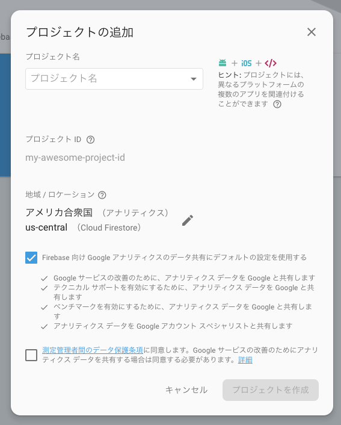
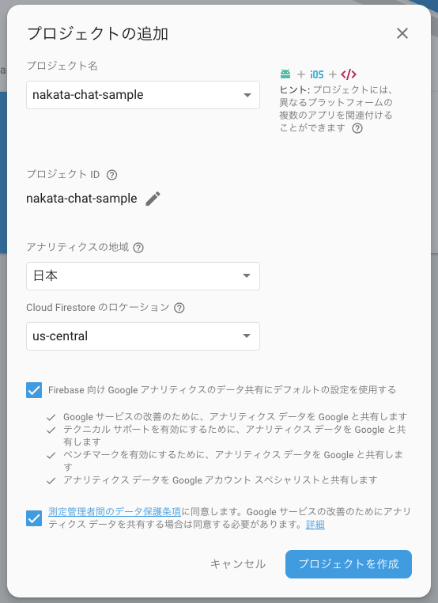
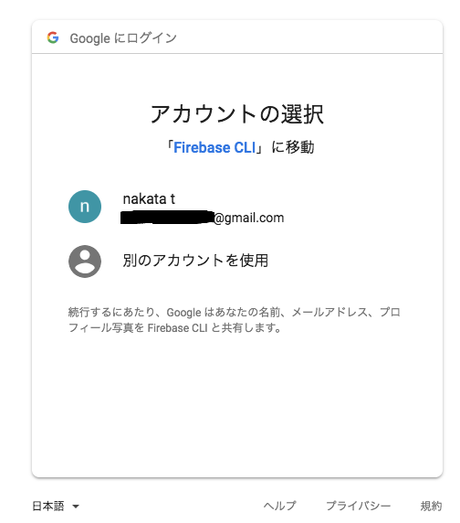
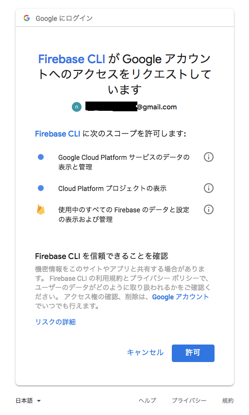
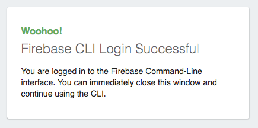
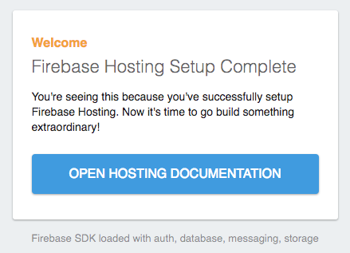

# Firebase　Hosting Functions 開発環境構築

### 事前準備
* VS Codeのインストール
```
$ brew cask install visual-studio-code
```

VSCodeを起動し`shift + command + p`で
シェルコマンド入力ウインドウが表示されます。

ここに`Shell Command`と入力する、候補が表示される  
`Shell Command: Install 'code' command in PATH`を選択
ターミナルで`code`コマンドが使用できるようになります。

macで統合型のターミナルを使用する場合は、  
`shift + control + @`でターミナルの表示・非常時を  
切り替えることができます。


---

* Firebaseでプロジェクトを追加する 
    * [Firebase console](https://console.firebase.google.com/?hl=ja)へアクセスする

    * プロジェクトを追加をクリック
    * プロジェクトの追加ダイアログが表示される。
    
    * プロジェクト名に好きな名前を入力する(今回は`nakata-chat-sample`としました。)
    * 地域は`日本`を選択
    * `測定管理者感のデータ保護条項`への同意にチェック
    
    * `プロジェクトを作成`をクリック
    * プロジェクトの作成が開始される。
    * 少し待つと次のような画面が表示されるので`次へ`をクリック
    
    * 下記のように表示されればFirebase側の準備は完了です。
    


---
### 1.仮想環境構築
```
$ brew cask install virtualbox
$ brew cask install vagrant
$ brew cask install vagrant-manager
```

任意の作業ディレクトリを作成  
(今回は`/User/[userName]/Desktop/firebase/`とします)

```
$ cd ~/Desktop
$ mkdir firebase
$ cd firebase
```

開発環境の設定ファイルのCheckout
```
$ git clone https://github.com/t-nakata/firebase-functions-sample.git
```

作業ディレクトリへ移動し、VS Codeを開く
```
$ cd firebase-functions-sample/
$ pwd 
/User/[userName]/Desktop/firevase/firebase-functions-sample
$ code .
$ vagrant up
```

---
### 2.ゲストOSへSSH接続
```
$ vagrant ssh
```  
下記のように表示されればssh接続成功

```
       __|  __|_  )
       _|  (     /   Amazon Linux AMI
      ___|\___|___|
https://aws.amazon.com/amazon-linux-ami/2017.03-release-notes/
30 package(s) needed for security, out of 39 available
Run "sudo yum update" to apply all updates.
Amazon Linux version 2018.03 is available.
```
---
### 3. Firebase Login
```
$ firebase login
```

```
? Allow Firebase to collect anonymous CLI usage and error reporting information? Yes  
```
y を入力しEnter
```
Visit this URL on any device to log in:
 https://accounts.google.com/o/oauth2/auth?client_id=563584335869-fgrhgmd47bqnekij5i8b5pr03ho849e6.apps.googleusercontent.com&scope=email%20openid%20https%3A%2F%2Fwww.googleapis.com%2Fauth%2Fcloudplatformprojects.readonly%20https%3A%2F%2Fwww.googleapis.com%2Fauth%2Ffirebase%20https%3A%2F%2Fwww.googleapis.com%2Fauth%2Fcloud-platform&response_type=code&state=834011273&redirect_uri=http%3A%2F%2Flocalhost%3A9005

Waiting for authentication...
(node:4005) UnhandledPromiseRejectionWarning: Unhandled promise rejection (rejection id: 1): Error: Exited with code 3
```

1. 上記URLをHostのブラウザで開く  
1. Googleアカウント選択画面が表示される  


1. Firebaseプロジェクトを登録しているアカウントを選択
1. Firebase CLIへのリクエストが表示される  

1. Googleアカウントを選択して`許可`を選択
1. 下記の様に表示される  
  
1. ログインに成功していれば、ターミナルには下記のように表示される
```
 ✔  Success! Logged in as xxxxxxxxx@gmail.com
```

---
### 4. Firebase init

##### 4.1. Firebase hostingの初期化
```
$ firebase init hosting
```

```
     ######## #### ########  ######## ########     ###     ######  ########
     ##        ##  ##     ## ##       ##     ##  ##   ##  ##       ##
     ######    ##  ########  ######   ########  #########  ######  ######
     ##        ##  ##    ##  ##       ##     ## ##     ##       ## ##
     ##       #### ##     ## ######## ########  ##     ##  ######  ########

You're about to initialize a Firebase project in this directory:

  /home/vagrant/root


=== Project Setup

First, let's associate this project directory with a Firebase project.
You can create multiple project aliases by running firebase use --add,
but for now we'll just set up a default project.
```
##### 4.1.1. Firebase projectの選択
```
? Select a default Firebase project for this directory: (Use arrow keys)
❯ [don't setup a default project]
  nakata-chat-sample (nakata-chat-sample)
  [create a new project]
```

上下キーでプロジェクトを選び`Enter`で決定

```
? Select a default Firebase project for this directory: nakata-chat-sample (nakata-chat-sample) 

=== Hosting Setup

Your public directory is the folder (relative to your project directory) that
will contain Hosting assets to be uploaded with firebase deploy. If you
have a build process for your assets, use your build's output directory.
```

##### 4.1.2. ディレクトリ選択
```
? What do you want to use as your public directory? (public)
```
そのまま`Enter`

```
? What do you want to use as your public directory? public
```

##### 4.1.3. 
```
? Configure as a single-page app (rewrite all urls to /index.html)? (y/N)
```

`y`を入力して`Enter`

```
? Configure as a single-page app (rewrite all urls to /index.html)? Yes
✔  Wrote public/index.html

i  Writing configuration info to firebase.json...
i  Writing project information to .firebaserc...

✔  Firebase initialization complete!
```
これでHostingの初期化は完了

---
##### 4.2. Firebase functionsの初期化

```
$ firebase init functions
```

```

     ######## #### ########  ######## ########     ###     ######  ########
     ##        ##  ##     ## ##       ##     ##  ##   ##  ##       ##
     ######    ##  ########  ######   ########  #########  ######  ######
     ##        ##  ##    ##  ##       ##     ## ##     ##       ## ##
     ##       #### ##     ## ######## ########  ##     ##  ######  ########

You're about to initialize a Firebase project in this directory:

  /home/vagrant/root

Before we get started, keep in mind:

  * You are initializing in an existing Firebase project directory


=== Project Setup

First, let's associate this project directory with a Firebase project.
You can create multiple project aliases by running firebase use --add,
but for now we'll just set up a default project.

i  .firebaserc already has a default project, skipping

=== Functions Setup

A functions directory will be created in your project with a Node.js
package pre-configured. Functions can be deployed with firebase deploy.
```

##### 4.2.1. 言語の選択
```
? What language would you like to use to write Cloud Functions? (Use arrow keys)
❯ JavaScript
  TypeScript
```

`JavaScript`を選択して`Enter`
```
? What language would you like to use to write Cloud Functions? JavaScript
```

##### 4.2.2. ESLintの使用
```
? Do you want to use ESLint to catch probable bugs and enforce style? (y/N)
```

`y`と入力して`Enter`
```
? Do you want to use ESLint to catch probable bugs and enforce style? Yes
✔  Wrote functions/package.json
✔  Wrote functions/.eslintrc.json
✔  Wrote functions/index.js
```

##### 4.2.3. Firebase functionsの関連パッケージのインストール確認
```
? Do you want to install dependencies with npm now? (Y/n)
```

`y`と入力して`Enter`

関連パッケージのインストールが始まり、10分程度で下記のように表示されれば
完了です。

```
i  Writing configuration info to firebase.json...
i  Writing project information to .firebaserc...

✔  Firebase initialization complete!
```

##### 5. サーバー起動
```
$ firebase serve --only hosting,functions -o 0.0.0.0
```

```
=== Serving from '/home/vagrant'...

i  functions: Preparing to emulate functions.
i  hosting: Serving hosting files from: public
✔  hosting: Local server: http://0.0.0.0:5000

i  functions: No HTTPS functions found. Use firebase functions:shell if you would like to emulate other types of functions.
```

ホストのブラウザで`http://localhost:5000`へアクセス  
下記のように表示されれば成功です  
  
